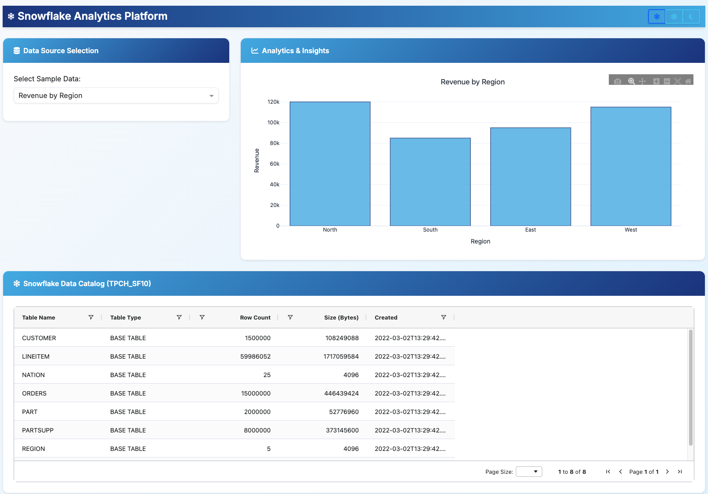

# Snowflake Dash Analytics App



A modern Dash application designed for deployment to **Snowflake Container Services (SPCS)** with full local development support. Features interactive data visualization, Snowflake integration, and a responsive UI with dark/light mode support.

🔗 **Repository**: https://github.com/sfc-gh-jkang/spcs-dash

## ⚡ Quick Start (5 minutes)

Want to try the app immediately?

1. `git clone https://github.com/sfc-gh-jkang/spcs-dash.git`
2. `cd spcs-dash && cp env.template .env`
3. Edit `.env` with your Snowflake credentials
4. `docker-compose up --build` or 'uv run app.py' to run without the docker overhead
5. Visit http://localhost:8000
6. To spin down your container run `docker-compose down`
7. Remember that this is NOT enough commands to deploy this Dash App to Snowflake

**Important - Dependency Updates**: If you update dependencies in `pyproject.toml`:
1. **Sync local**: `uv sync`
2. **Verify local**: `uv run app.py` → test health endpoint
3. **Clean Docker**: `docker-compose down && docker system prune -f`
4. **Rebuild Docker**: `docker-compose build --no-cache && docker-compose up -d`
5. **Verify Docker**: `curl -s http://localhost:8000/health | python3 -m json.tool`

*See troubleshooting section for detailed explanation of why this process is necessary.*

You'll see:
- 📊 **Interactive Dashboard**: Revenue by region, customer growth charts
- 📋 **Snowflake Data Browser**: Live tables from `SNOWFLAKE_SAMPLE_DATA.TPCH_SF10`
- 🎨 **Three-Theme System**: Snowflake, Light, and Dark themes with enhanced button styling
- 🔍 **Advanced Data Grid**: Sort, filter, paginate 60M+ rows (CUSTOMER, ORDERS, LINEITEM, etc.)
- 📈 **Real-time Metrics**: Row counts, table sizes, creation dates with NYC timezone

## 🚀 Features

- **Dual Environment Support**: Seamlessly runs locally and in Snowflake Container Services
- **Interactive Data Grid**: Browse Snowflake tables with sorting, filtering, and pagination
- **Modern UI**: Snowflake-inspired design with three professional themes (Snowflake, Light, Dark)
- **Enhanced Theme System**: Interactive theme buttons with hover effects and proper visual feedback
- **Real-time Analytics**: Interactive charts and visualizations with theme-aware Plotly styling
- **Robust Logging**: Comprehensive logging with NYC timezone support
- **Clean Architecture**: Externalized CSS for better maintainability and performance
- **Container Ready**: Optimized Docker setup for SPCS deployment

## 📋 Prerequisites

- **Python 3.13+**
- **Docker & Docker Compose**
- **uv** (Python package manager)
- **Snowflake Account** with access to `SNOWFLAKE_SAMPLE_DATA` share
- **SPCS-enabled Snowflake Account** (for container deployment)

## 🏠 Local Development

### 1. Install UV Package Manager

**macOS/Linux:**
```bash
curl -LsSf https://astral.sh/uv/install.sh | sh
```

**Windows:**
```powershell
powershell -ExecutionPolicy ByPass -c "irm https://astral.sh/uv/install.ps1 | iex"
```

### 2. Clone and Setup

```bash
git clone https://github.com/sfc-gh-jkang/spcs-dash.git
cd spcs-dash

# Create virtual environment
uv venv

# Activate virtual environment
source .venv/bin/activate  # Linux/macOS
# .venv\Scripts\activate   # Windows

# Install dependencies
uv sync
```

### 3. Configure Environment

```bash
# Copy environment template
cp env.template .env

# Edit .env with your Snowflake credentials
nano .env  # or your preferred editor
```

**Required .env variables:**
```bash
SNOWFLAKE_ACCOUNT=your_account.region
SNOWFLAKE_USER=your_username
SNOWFLAKE_PASSWORD=your_password
SNOWFLAKE_WAREHOUSE=COMPUTE_WH
SNOWFLAKE_DATABASE=your_database
SNOWFLAKE_SCHEMA=PUBLIC
```

### 4. Run Locally

```bash
# With UV
uv run app.py

# Or with Python directly
python app.py
```

Visit: **http://localhost:8000**

> **Note**: Local development uses port **8000**, while SPCS uses port **8000** as well

### 5. Code Quality

```bash
# Lint and format code
uv run ruff check --fix

# Check for issues
uv run ruff check
```

## 🐳 Docker Development

### Quick Start

```bash
# Create environment file
cp env.template .env
# Edit .env with your credentials

# Build and run
docker-compose up --build
```

Visit: **http://localhost:8000**

### Docker Commands

```bash
# Build image
docker-compose build

# Run in background
docker-compose up -d

# View logs
docker-compose logs -f

# Stop services
docker-compose down

# Interactive debugging
docker-compose run --rm spcs-dash-app /bin/bash
```

## ☁️ Snowflake Container Services Deployment

### 1. Snowflake Setup

```sql
-- Create role and user
CREATE OR REPLACE ROLE fullstack_service_role;
CREATE OR REPLACE USER fullstack_user
    PASSWORD = '<secure_password>'
    DEFAULT_WAREHOUSE = 'fullstack_wh' 
    DEFAULT_ROLE = 'fullstack_service_role';

-- Create infrastructure
CREATE OR REPLACE DATABASE fullstack_db;
CREATE OR REPLACE WAREHOUSE fullstack_wh WITH
    WAREHOUSE_SIZE='X-SMALL'
    AUTO_SUSPEND=60
    AUTO_RESUME = True;

CREATE COMPUTE POOL fullstack_compute_pool
    MIN_NODES = 1
    MAX_NODES = 1
    INSTANCE_FAMILY = CPU_X64_S
    INITIALLY_SUSPENDED = FALSE
    AUTO_SUSPEND_SECS = 360
    AUTO_RESUME = True;

-- Grant permissions
GRANT OWNERSHIP ON DATABASE fullstack_db TO ROLE fullstack_service_role COPY CURRENT GRANTS;
GRANT IMPORTED PRIVILEGES ON DATABASE SNOWFLAKE_SAMPLE_DATA TO ROLE fullstack_service_role; 
GRANT USAGE, MONITOR ON COMPUTE POOL fullstack_compute_pool TO ROLE fullstack_service_role;
GRANT USAGE ON WAREHOUSE fullstack_wh TO ROLE fullstack_service_role;
GRANT BIND SERVICE ENDPOINT ON ACCOUNT TO ROLE fullstack_service_role;
GRANT CREATE INTEGRATION ON ACCOUNT TO ROLE fullstack_service_role; 
GRANT ROLE fullstack_service_role TO ROLE ACCOUNTADMIN;
```

### 2. Setup Sample Data

```sql
-- Mount sample data share
CREATE DATABASE IDENTIFIER('SNOWFLAKE_SAMPLE_DATA') 
FROM SHARE IDENTIFIER('SFC_SAMPLES."SAMPLE_DATA"');
```

### 3. Prepare for Deployment

```sql
-- Use the service role
USE ROLE fullstack_service_role;
USE DATABASE fullstack_db;
USE WAREHOUSE fullstack_wh;

-- Create schemas
CREATE SCHEMA IF NOT EXISTS fullstack_db.devops;
CREATE SCHEMA IF NOT EXISTS fullstack_db.application;

-- Create image repository
USE SCHEMA fullstack_db.devops;
CREATE IMAGE REPOSITORY IF NOT EXISTS fullstack_db.devops.images;

-- Create stage for specs
CREATE STAGE IF NOT EXISTS fullstack_db.devops.specs
DIRECTORY = ( ENABLE = true );
```

-- Enable access to External Resources
Our application uses external stylesheets. 
We will need to permit our service to access these external resources. Permitting access to external resources requires two steps:

* Create a NETWORK RULE which allows egress on a specified port to a domain name.
* Create an EXTERNAL ACCESS INTEGRATION which allows access to the external resource defined in the network rule

Enable access to external resources with the following:

1. Create a new NETWORK RULE called `bootstrap_npm_network_rule` in the `application` SCHEMA which will allow egress to a host `cdn.jsdelivr.net`

    From a SQL console run:

    ```sql
    CREATE OR REPLACE NETWORK RULE fullstack_db.application.bootstrap_npm_network_rule
    MODE = EGRESS
    TYPE = HOST_PORT
    VALUE_LIST = ('cdn.jsdelivr.net');
    ```

2. Create an EXTERNAL ACCESS INTEGRATION called `bootstrap_npm_external_access` which uses the fullstack_db.application.bootstrap_npm_network_rule, and is enabled by default.

    From a SQL console run:

    ```sql
    CREATE OR REPLACE EXTERNAL ACCESS INTEGRATION bootstrap_npm_external_access
    ALLOWED_NETWORK_RULES = ( fullstack_db.application.bootstrap_npm_network_rule )
    ENABLED = true;
    ```
3. Create a new WORK RULE called `fontawesome_network_rule` in the `application` SCHEMA which will allow egress to a host
`use.fontawesome.com`
```sql
CREATE OR REPLACE NETWORK RULE fullstack_db.application.fontawesome_network_rule
    MODE = EGRESS
    TYPE = HOST_PORT
    VALUE_LIST = ('use.fontawesome.com');
```

4. Create an EXTERNAL ACCESS INTEGRATION called `fontawesome_external_access` which uses the fullstack_db.application.fontawesome_network_rule, and is enabled by default.
 ```sql
CREATE OR REPLACE EXTERNAL ACCESS INTEGRATION fontawesome_external_access
    ALLOWED_NETWORK_RULES = ( fullstack_db.application.fontawesome_network_rule )
    ENABLED = true;
```
5. Grant usage
```sql
GRANT USAGE ON INTEGRATION pypi_access TO ROLE fullstack_service_role;
GRANT USAGE ON INTEGRATION bootstrap_npm_external_access TO ROLE fullstack_service_role;
GRANT USAGE ON INTEGRATION fontawesome_external_access TO ROLE fullstack_service_role;
```

### 4. Authenticate with Snowflake Registry

```bash
# Login to Snowflake Docker registry (use your Snowflake credentials)
docker login <your-account>.registry.snowflakecomputing.com
# Enter your Snowflake username and password when prompted
```

### 5. Deploy Container

```bash
# Build for SPCS (linux/amd64 platform required)
docker build --platform linux/amd64 -t spcs-dash-app:latest .

# Tag for Snowflake registry
The <your-account> needs to replace all '_' with '-' and be all lowercase
For instance: GENERIC-BOOM_AWS_US_EAST_1_1 would be generic-boom-aws-us-east-1-1
docker tag spcs-dash-app:latest <your-account>.registry.snowflakecomputing.com/fullstack_db/devops/images/dash_app

# Push to Snowflake registry
The <your-account> needs to replace all '_' with '-' and be all lowercase
docker push <your-account>.registry.snowflakecomputing.com/fullstack_db/devops/images/dash_app:latest

# Verify image was pushed successfully
SHOW IMAGES IN IMAGE REPOSITORY fullstack_db.devops.images;
```

### 6. Create SPCS Service

First, create your deployment configuration from the template:

```bash
# Copy template and customize with your account details
cp dash-app.template.yml dash-app.yml

# Edit dash-app.yml and replace placeholders:
# - <YOUR_ACCOUNT> with your Snowflake account identifier
```

Your `dash-app.yml` should look like:

```yaml
spec:
  containers:
  - name: dash-app
    image: <your-account>.registry.snowflakecomputing.com/fullstack_db/devops/images/dash_app:latest
    env:
      SNOWFLAKE_WAREHOUSE: fullstack_wh
      SNOWFLAKE_DATABASE: fullstack_db
      SNOWFLAKE_SCHEMA: application
  endpoints:
  - name: app
    port: 8000
    public: true
```

Upload and create the service:

```sql
-- Upload service spec to stage
* From VScode or your preferred tool upload the fullstack.yml file to the specs stage.

-- Create the service
CREATE SERVICE fullstack_db.application.dash_app_service
  IN COMPUTE POOL fullstack_compute_pool
  FROM @fullstack_db.devops.specs
  SPEC='dash-app.yml'
  EXTERNAL_ACCESS_INTEGRATIONS = (PYPI_ACCESS, BOOTSTRAP_NPM_EXTERNAL_ACCESS, FONTAWESOME_EXTERNAL_ACCESS);

-- Check service status
SELECT SYSTEM$GET_SERVICE_STATUS('fullstack_db.application.dash_service');

-- Get service logs
SELECT SYSTEM$GET_SERVICE_LOGS('fullstack_db.application.dash_service', '0', 'dash-app');

-- Get public endpoint URL
SHOW ENDPOINTS IN SERVICE fullstack_db.application.dash_service;
```

### 7. Test Your Deployment

Once the service is running:

1. **Get the endpoint URL** from the `SHOW ENDPOINTS` command above
2. **Visit the URL** in your browser and login
3. **Check logs** if issues occur:
   ```sql
   SELECT SYSTEM$GET_SERVICE_LOGS('fullstack_db.application.dash_service', '0', 'dash-app', 50);
   ```
4. **Verify data access** - the app should show Snowflake tables from `SNOWFLAKE_SAMPLE_DATA.TPCH_SF10`

## 🏗️ Project Structure

```
spcs-dash/
├── app.py                    # Main Dash application with dual environment support
├── static/
│   └── styles.css           # Snowflake-inspired CSS with three-theme system
├── docker-compose.yml        # Local development with Docker setup
├── Dockerfile               # UV-optimized container configuration
├── pyproject.toml           # Python dependencies and project metadata
├── uv.lock                  # Locked dependencies for reproducible builds
├── env.template             # Environment variables template
├── .env                     # Local environment (create from template)
├── .gitignore              # Git ignore rules (includes .env)
├── dash-app.template.yml    # SPCS service specification template
├── dash-app.yml            # SPCS deployment config (create from template)
├── README.md               # Comprehensive documentation
└── app.log                 # Application logs (generated at runtime)
```

### Key Files Explained

- **`app.py`**: Main application with automatic environment detection (local vs SPCS) and clean architecture
- **`static/styles.css`**: Snowflake-inspired styling with professional three-theme system (Snowflake/Light/Dark)
- **`docker-compose.yml`**: Local development environment with port 8000
- **`Dockerfile`**: Production-ready container with UV package manager and virtual environment activation
- **`pyproject.toml`**: Modern Python dependency management with pytz for timezone handling
- **`env.template`**: Template for required environment variables
- **`dash-app.template.yml`**: Template for Snowflake Container Services specification
- **`dash-app.yml`**: Your personalized SPCS deployment config (create from template)

## 🔧 Technical Stack

- **Frontend**: Dash 3.2.0, Bootstrap Components 2.0.3, AG Grid 32.3.0+
- **Backend**: Python 3.13+, Snowflake Snowpark 1.35.0+, pytz 2025.2+
- **Visualization**: Plotly 6.2.0, Pandas 2.3.1
- **Styling**: External CSS architecture with Snowflake-inspired themes
- **Timezone**: pytz with America/New_York for accurate EST/EDT handling
- **Development**: UV package manager, Ruff linting
- **Container**: Docker with UV-optimized base images and virtual environment
- **Deployment**: Snowflake Container Services (SPCS)

### Authentication
- **Local**: Username/password via `.env` file
- **SPCS**: Automatic token-based authentication

## 🔍 Environment Detection

The app automatically detects its runtime environment:

- **Local**: Uses credentials from `.env` file
- **SPCS**: Uses automatic service account authentication

Check logs for environment detection:
```
INFO - Detected local development environment - using credential authentication
INFO - Detected Snowpark Container Services environment - using token authentication
```

## 🎨 Theme System & UI Architecture

### Three Professional Themes
The application features a sophisticated three-theme system inspired by [Snowflake's website design](https://www.snowflake.com/en/):

- **🔵 Snowflake Theme** (Default): Professional blue gradients and modern styling
- **☀️ Light Theme**: Clean white background with high contrast
- **🌙 Dark Theme**: Dark gradients optimized for low-light environments

### Enhanced Theme Controls
- **Interactive theme buttons** with visual feedback and hover effects
- **Persistent theme selection** across browser sessions
- **Automatic component styling** - all UI elements adapt to selected theme
- **Theme-aware data visualizations** with Plotly integration

### CSS Architecture
- **External CSS file** (`static/styles.css`) for better maintainability
- **CSS custom properties** for consistent color schemes
- **Responsive design** with Bootstrap integration
- **Performance optimized** - CSS can be cached separately by browsers

### Health Check Enhancements
The `/health` endpoint now includes comprehensive system information:
```bash
curl -s http://localhost:8000/health | python3 -m json.tool
```

**Response includes:**
- **Status**: Application health status
- **Timestamps**: UTC and NYC local time with automatic EST/EDT detection
- **Timezone**: Current timezone information
- **Library versions**: All Python dependencies for verification

## 🔒 Security Considerations

### Local Development
- **Keep `.env` file secure** and never commit it to version control
- **Use least-privilege Snowflake accounts** - grant only necessary permissions
- **Regularly rotate passwords** and use strong authentication
- **Network security** - ensure secure connections to Snowflake

### SPCS Deployment  
- **No stored credentials** - service uses automatic token authentication
- **Network isolation** - access controlled by Snowflake's security model
- **Private endpoints** - consider using for sensitive data access
- **Role-based access** - service inherits permissions from service role
- **Audit logging** - all queries are logged in Snowflake's audit trail

### Best Practices
- **Monitor service logs** regularly for security events
- **Use compute pools** with appropriate resource limits
- **Implement proper error handling** to avoid information leakage
- **Regular security reviews** of service configurations

## ⚡ Performance Optimization

### For Large Datasets
- **Scale warehouse** - increase size for faster queries:
  ```sql
  ALTER WAREHOUSE fullstack_wh SET WAREHOUSE_SIZE = 'MEDIUM';
  ```
- **Enable result caching** for repeated queries (enabled by default)
- **Use LIMIT clauses** for initial data exploration
- **Consider clustering keys** for frequently filtered columns
- **Scale compute pool** for faster app performance and to improve concurrency issues

### SPCS Resource Tuning

For better performance, adjust the compute pool resources

### Query Optimization
- **Use warehouse auto-suspend** to save costs
- **Monitor query performance** in Snowflake's Query History
- **Optimize data types** in your analysis queries
- **Use materialized views** for frequently accessed aggregations

## 🚨 Troubleshooting

### Common Issues

**Connection Errors:**
- Verify Snowflake credentials in `.env`
- Check network connectivity
- Ensure warehouse is running
- Confirm access to `SNOWFLAKE_SAMPLE_DATA` database and `TPCH_SF10` schema

**Docker Issues:**
- Rebuild with `docker-compose up --build`
- Check port conflicts (8000)
- Verify environment variables

**Health Check Monitoring:**
```bash
# Check application health and library versions
curl -f http://localhost:8000/health

# Browser: http://localhost:8000/health
# Docker: docker-compose ps
```

*Response includes status, timestamps (UTC + NYC), and all library versions for verification.*

**Package Errors:**
- Update dependencies: `uv sync`
- Clear UV cache: `uv cache clean`

**Virtual Environment Sync Issues:**

After updating `pyproject.toml`:
```bash
# 1. Sync local environment
uv sync && uv run app.py

# 2. Rebuild Docker (aggressive cleanup for persistent cache issues)
docker-compose down && docker system prune -f
docker-compose build --no-cache && docker-compose up -d

# 3. Verify versions match
curl localhost:8000/health | grep -A 10 "versions"
```

*Note: UV uses `--locked` dependencies, requiring `uv sync` to update `uv.lock`. Docker caching may persist without `system prune -f`.*

**Fast Local Debugging:**

For faster debugging of `app.py` issues without Docker overhead:
```bash
# Run the app directly with UV (faster than docker-compose)
uv run app.py
```

This approach:
- ✅ **Faster startup** - No Docker build/container overhead
- ✅ **Immediate code changes** - No rebuild required
- ✅ **Direct error messages** - See Python errors directly in terminal
- ✅ **Better debugging** - Use breakpoints and debugging tools
- ✅ **Uses local environment** - Reads from your `.env` file

Note: Make sure you have a `.env` file with your Snowflake credentials before running locally.

**SPCS Deployment Issues:**
- Check service status: ```
DESCRIBE SERVICE fullstack_db.application.dash_app_service;
SHOW SERVICE CONTAINERS IN SERVICE fullstack_db.application.dash_app_service;
SHOW ENDPOINTS IN SERVICE fullstack_db.application.dash_app_service;
select * FROM TABLE(fullstack_db.application.dash_app_service!SPCS_GET_LOGS());
```
- View service logs: ```SELECT value AS log_line
  FROM TABLE(
    SPLIT_TO_TABLE(SYSTEM$GET_SERVICE_LOGS('fullstack_db.application.dash_app_service', 0, 'dash-app'), '\n')
  );
```
- Verify compute pool is running: `SHOW COMPUTE POOLS;`
- Ensure image was pushed successfully to registry

**Registry Issues:**
```bash
# If docker push fails with authentication error:
docker logout <account>.registry.snowflakecomputing.com
docker login <account>.registry.snowflakecomputing.com

# If image not found in SPCS:
SHOW IMAGES IN IMAGE REPOSITORY fullstack_db.devops.images;

# If registry access denied, check permissions:
SHOW GRANTS ON IMAGE REPOSITORY fullstack_db.devops.images;
```

**Service Creation Issues:**
```sql
-- If service fails to start, check detailed status:
SELECT SYSTEM$GET_SERVICE_STATUS('fullstack_db.application.dash_service');

-- Drop and recreate service if needed:
DROP SERVICE IF EXISTS fullstack_db.application.dash_service;

CREATE SERVICE fullstack_db.application.dash_app_service
IN COMPUTE POOL fullstack_compute_pool
FROM @fullstack_db.devops.specs
SPEC = 'dash-app.yml'
EXTERNAL_ACCESS_INTEGRATIONS = (PYPI_ACCESS, BOOTSTRAP_NPM_EXTERNAL_ACCESS, FONTAWESOME_EXTERNAL_ACCESS);
-- Alternative if suspending and resuming will work
ALTER SERVICE IF EXISTS fullstack_db.application.dash_app_service SUSPEND;
ALTER SERVICE IF EXISTS fullstack_db.application.dash_app_service RESUME;


-- Check compute pool capacity:
DESCRIBE COMPUTE POOL fullstack_compute_pool;
-- Describe the service
DESCRIBE SERVICE fullstack_db.application.dash_app_service;
-- Get the service status
SELECT SYSTEM$GET_SERVICE_STATUS('fullstack_db.application.dash_app_service');
-- Show the endpoints in the service
SHOW ENDPOINTS IN SERVICE fullstack_db.application.dash_app_service;
-- Check the logs from within the container
SELECT value AS log_line
  FROM TABLE(
    SPLIT_TO_TABLE(SYSTEM$GET_SERVICE_LOGS('fullstack_db.application.dash_app_service', 0, 'dash-app'), '\n')
  );

```
### Debug Mode

```bash
# Run with verbose logging
DASH_DEBUG=true docker-compose up

# Interactive container debugging
docker-compose run --rm spcs-dash-app /bin/bash
```

## 📝 Development Workflow

### Complete Development Cycle

1. **Setup Development Environment**
   ```bash
   git clone https://github.com/sfc-gh-jkang/spcs-dash.git
   cd spcs-dash
   cp env.template .env  # Edit with your credentials
   uv venv && source .venv/bin/activate
   uv sync
   ```

2. **Local Development**
   ```bash
   uv run app.py                    # Test on http://localhost:8000
   uv run ruff check --fix          # Lint and format code
   ```

3. **Docker Testing**
   ```bash
   docker-compose up --build        # Test on http://localhost:8000
   docker-compose logs -f           # Monitor logs
   ```

4. **Prepare for Production**
   ```bash
   # Build production image
   docker build --platform linux/amd64 -t spcs-dash-app:latest .
   
   # Test production build locally
   docker run -p 8000:8000 spcs-dash-app:latest
   ```

5. **Deploy to SPCS**
   ```bash
   # Authentication and deployment
   docker login <account>.registry.snowflakecomputing.com
   docker tag spcs-dash-app:latest <your-account>.registry.snowflakecomputing.com/fullstack_db/devops/images/dash_app
   docker push <account>.registry.snowflakecomputing.com/fullstack_db/devops/images/dash_app:latest
   ```

6. **Monitor Production**
   ```sql
   -- Check service health
   SELECT SYSTEM$GET_SERVICE_STATUS('fullstack_db.application.dash_service');
   
   -- View application logs
   SELECT SYSTEM$GET_SERVICE_LOGS('fullstack_db.application.dash_service', '0', 'dash-app', 100);
   ```

### Code Quality Checklist

- ✅ **Linting**: `uv run ruff check --fix`
- ✅ **Local testing**: App runs on `localhost:8000`
- ✅ **Docker testing**: App runs on `localhost:8000`
- ✅ **Environment detection**: Check logs for correct environment
- ✅ **Data access**: Verify connection to Snowflake sample data
- ✅ **Error handling**: Test with invalid credentials

## 🤝 Contributing

1. Fork the repository
2. Create a feature branch
3. Make your changes
4. Run tests and linting
5. Submit a pull request

## 📄 License

This project is licensed under the MIT License.

## 🔗 Links

- **Repository**: https://github.com/sfc-gh-jkang/spcs-dash
- **Snowflake Container Services**: [Documentation](https://docs.snowflake.com/en/developer-guide/snowpark-container-services)
- **Dash Framework**: [Documentation](https://dash.plotly.com/) 